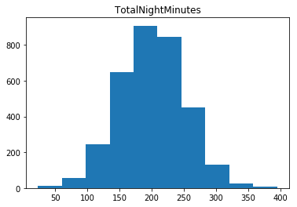

# Churn forecasting and management

https://www.kaggle.com/pangkw/telco-churn/version/3

__Business case__: Our client is Triple Telco and they provide triple service communication services to consumers (landline phone, fast internet and TV service). Up until a few months ago they were the only triple play provider in their area. However, new provider entered their market and they've seen a dramatic increase in customers who "churn" (i.e. leave).

They hired Bain to help identify drivers of churn and recommend actions to prevent it.

__Note: This notebook will not be shared with trainees__

# Sprint 1

* Load the necessary libraries
* Load the data
* Explore data – what types, any obvious issues
* Run mechanical feature engineering (longest part)
* Split data
* Run logistic regression
* Explore coefficients
* Deep dive on the most predictive data
* Clean-up data (if necessary)
* Re-run logistic regression (if necessary)


## Load all the necessary libraries


```javascript
%%javascript
// Ensure our output is sufficiently large
IPython.OutputArea.auto_scroll_threshold = 9999;
```


    <IPython.core.display.Javascript object>


```python
# Emnsure all charts plotted automatically
%matplotlib inline

import warnings
import numpy as np
import pandas as pd

import sklearn
import sklearn.linear_model

from sklearn.metrics import confusion_matrix, precision_recall_fscore_support, roc_curve, auc
from sklearn import preprocessing

from sklearn_pandas import DataFrameMapper

from xgboost import XGBClassifier

from IPython.display import display, Markdown

import matplotlib.pyplot as plt
import seaborn as sns

# Don't truncate dataframe displays columwise
pd.set_option('display.max_columns', None)  
```

## Engineer Data: Load the data

You load the CSV data into a Pandas object. This is a common Python library to work with data in row/column format, like .csv files.

Print out top 10 rows just to get a feel for the data


```python


df = pd.read_csv('telco_churn_dataset.csv', sep=',', header=0)
display(df.head(10))
display(df.shape)
```


<div>
<style scoped>
    .dataframe tbody tr th:only-of-type {
        vertical-align: middle;
    }

    .dataframe tbody tr th {
        vertical-align: top;
    }

    .dataframe thead th {
        text-align: right;
    }
</style>
<table border="1" class="dataframe">
  <thead>
    <tr style="text-align: right;">
      <th></th>
      <th>customerID</th>
      <th>gender</th>
      <th>SeniorCitizen</th>
      <th>MaritalStatus</th>
      <th>Dependents</th>
      <th>tenure</th>
      <th>PhoneService</th>
      <th>MultipleLines</th>
      <th>InternetService</th>
      <th>OnlineSecurity</th>
      <th>OnlineBackup</th>
      <th>DeviceProtection</th>
      <th>TechSupport</th>
      <th>StreamingTV</th>
      <th>StreamingMovies</th>
      <th>Contract</th>
      <th>PaperlessBilling</th>
      <th>PaymentMethod</th>
      <th>InternationalPlan</th>
      <th>VoiceMailPlan</th>
      <th>NumbervMailMessages</th>
      <th>TotalDayMinutes</th>
      <th>TotalDayCalls</th>
      <th>TotalEveMinutes</th>
      <th>TotalEveCalls</th>
      <th>TotalNightMinutes</th>
      <th>TotalNightCalls</th>
      <th>TotalIntlMinutes</th>
      <th>TotalIntlCalls</th>
      <th>CustomerServiceCalls</th>
      <th>TotalCall</th>
      <th>TotalHighBandwidthMinutes</th>
      <th>TotalHighLatencyMinutes</th>
      <th>TotalRevenue</th>
      <th>Churn</th>
    </tr>
  </thead>
  <tbody>
    <tr>
      <th>0</th>
      <td>0002-ORFBO</td>
      <td>Female</td>
      <td>0</td>
      <td>Yes</td>
      <td>Yes</td>
      <td>9</td>
      <td>Yes</td>
      <td>No</td>
      <td>DSL</td>
      <td>No</td>
      <td>Yes</td>
      <td>No</td>
      <td>Yes</td>
      <td>Yes</td>
      <td>No</td>
      <td>One year</td>
      <td>Yes</td>
      <td>Mailed check</td>
      <td>No</td>
      <td>No</td>
      <td>0</td>
      <td>168.8</td>
      <td>137</td>
      <td>241.4</td>
      <td>107</td>
      <td>204.8</td>
      <td>106</td>
      <td>15.5</td>
      <td>4</td>
      <td>0</td>
      <td>354</td>
      <td>705</td>
      <td>119</td>
      <td>593.3</td>
      <td>No</td>
    </tr>
    <tr>
      <th>1</th>
      <td>0004-TLHLJ</td>
      <td>Male</td>
      <td>0</td>
      <td>No</td>
      <td>No</td>
      <td>4</td>
      <td>Yes</td>
      <td>No</td>
      <td>Fiber optic</td>
      <td>No</td>
      <td>No</td>
      <td>Yes</td>
      <td>No</td>
      <td>No</td>
      <td>No</td>
      <td>Month-to-month</td>
      <td>Yes</td>
      <td>Electronic check</td>
      <td>Yes</td>
      <td>No</td>
      <td>0</td>
      <td>122.2</td>
      <td>112</td>
      <td>131.7</td>
      <td>94</td>
      <td>169.5</td>
      <td>106</td>
      <td>10.3</td>
      <td>9</td>
      <td>5</td>
      <td>326</td>
      <td>292</td>
      <td>75</td>
      <td>280.9</td>
      <td>Yes</td>
    </tr>
    <tr>
      <th>2</th>
      <td>0013-MHZWF</td>
      <td>Female</td>
      <td>0</td>
      <td>No</td>
      <td>Yes</td>
      <td>9</td>
      <td>Yes</td>
      <td>No</td>
      <td>DSL</td>
      <td>No</td>
      <td>No</td>
      <td>No</td>
      <td>Yes</td>
      <td>Yes</td>
      <td>Yes</td>
      <td>Month-to-month</td>
      <td>Yes</td>
      <td>Credit card (automatic)</td>
      <td>No</td>
      <td>Yes</td>
      <td>36</td>
      <td>178.7</td>
      <td>134</td>
      <td>178.6</td>
      <td>102</td>
      <td>126.8</td>
      <td>82</td>
      <td>8.0</td>
      <td>4</td>
      <td>2</td>
      <td>324</td>
      <td>1840</td>
      <td>257</td>
      <td>571.5</td>
      <td>No</td>
    </tr>
    <tr>
      <th>3</th>
      <td>0013-SMEOE</td>
      <td>Female</td>
      <td>1</td>
      <td>Yes</td>
      <td>No</td>
      <td>71</td>
      <td>Yes</td>
      <td>No</td>
      <td>Fiber optic</td>
      <td>Yes</td>
      <td>Yes</td>
      <td>Yes</td>
      <td>Yes</td>
      <td>Yes</td>
      <td>Yes</td>
      <td>Two year</td>
      <td>Yes</td>
      <td>Bank transfer (automatic)</td>
      <td>No</td>
      <td>No</td>
      <td>0</td>
      <td>190.2</td>
      <td>68</td>
      <td>262.2</td>
      <td>64</td>
      <td>130.0</td>
      <td>92</td>
      <td>8.8</td>
      <td>4</td>
      <td>0</td>
      <td>228</td>
      <td>1389</td>
      <td>180</td>
      <td>7904.3</td>
      <td>No</td>
    </tr>
    <tr>
      <th>4</th>
      <td>0015-UOCOJ</td>
      <td>Female</td>
      <td>1</td>
      <td>No</td>
      <td>No</td>
      <td>7</td>
      <td>Yes</td>
      <td>No</td>
      <td>DSL</td>
      <td>Yes</td>
      <td>No</td>
      <td>No</td>
      <td>No</td>
      <td>No</td>
      <td>No</td>
      <td>Month-to-month</td>
      <td>Yes</td>
      <td>Electronic check</td>
      <td>No</td>
      <td>No</td>
      <td>0</td>
      <td>67.7</td>
      <td>68</td>
      <td>195.7</td>
      <td>86</td>
      <td>236.5</td>
      <td>137</td>
      <td>12.0</td>
      <td>2</td>
      <td>1</td>
      <td>294</td>
      <td>170</td>
      <td>1</td>
      <td>340.4</td>
      <td>No</td>
    </tr>
    <tr>
      <th>5</th>
      <td>0018-NYROU</td>
      <td>Female</td>
      <td>0</td>
      <td>Yes</td>
      <td>No</td>
      <td>5</td>
      <td>Yes</td>
      <td>No</td>
      <td>Fiber optic</td>
      <td>No</td>
      <td>No</td>
      <td>No</td>
      <td>No</td>
      <td>No</td>
      <td>No</td>
      <td>Month-to-month</td>
      <td>Yes</td>
      <td>Electronic check</td>
      <td>No</td>
      <td>No</td>
      <td>0</td>
      <td>174.3</td>
      <td>95</td>
      <td>186.6</td>
      <td>128</td>
      <td>258.2</td>
      <td>105</td>
      <td>12.9</td>
      <td>5</td>
      <td>3</td>
      <td>336</td>
      <td>112</td>
      <td>17</td>
      <td>351.5</td>
      <td>No</td>
    </tr>
    <tr>
      <th>6</th>
      <td>0021-IKXGC</td>
      <td>Female</td>
      <td>1</td>
      <td>No</td>
      <td>No</td>
      <td>1</td>
      <td>Yes</td>
      <td>Yes</td>
      <td>Fiber optic</td>
      <td>No</td>
      <td>No</td>
      <td>No</td>
      <td>No</td>
      <td>No</td>
      <td>No</td>
      <td>Month-to-month</td>
      <td>Yes</td>
      <td>Electronic check</td>
      <td>Yes</td>
      <td>No</td>
      <td>0</td>
      <td>111.9</td>
      <td>55</td>
      <td>223.0</td>
      <td>124</td>
      <td>243.2</td>
      <td>81</td>
      <td>10.0</td>
      <td>7</td>
      <td>3</td>
      <td>270</td>
      <td>47</td>
      <td>9</td>
      <td>72.1</td>
      <td>No</td>
    </tr>
    <tr>
      <th>7</th>
      <td>0022-TCJCI</td>
      <td>Male</td>
      <td>1</td>
      <td>No</td>
      <td>No</td>
      <td>45</td>
      <td>Yes</td>
      <td>No</td>
      <td>DSL</td>
      <td>Yes</td>
      <td>No</td>
      <td>Yes</td>
      <td>No</td>
      <td>No</td>
      <td>Yes</td>
      <td>One year</td>
      <td>No</td>
      <td>Credit card (automatic)</td>
      <td>No</td>
      <td>No</td>
      <td>0</td>
      <td>303.2</td>
      <td>133</td>
      <td>170.5</td>
      <td>86</td>
      <td>227.6</td>
      <td>80</td>
      <td>11.5</td>
      <td>3</td>
      <td>0</td>
      <td>302</td>
      <td>450</td>
      <td>76</td>
      <td>2791.5</td>
      <td>Yes</td>
    </tr>
    <tr>
      <th>8</th>
      <td>0030-FNXPP</td>
      <td>Female</td>
      <td>0</td>
      <td>No</td>
      <td>No</td>
      <td>3</td>
      <td>Yes</td>
      <td>No</td>
      <td>No</td>
      <td>No internet service</td>
      <td>No internet service</td>
      <td>No internet service</td>
      <td>No internet service</td>
      <td>No internet service</td>
      <td>No internet service</td>
      <td>Month-to-month</td>
      <td>No</td>
      <td>Mailed check</td>
      <td>No</td>
      <td>No</td>
      <td>0</td>
      <td>60.4</td>
      <td>158</td>
      <td>306.2</td>
      <td>120</td>
      <td>123.9</td>
      <td>46</td>
      <td>12.4</td>
      <td>3</td>
      <td>1</td>
      <td>328</td>
      <td>0</td>
      <td>0</td>
      <td>57.2</td>
      <td>No</td>
    </tr>
    <tr>
      <th>9</th>
      <td>0031-PVLZI</td>
      <td>Female</td>
      <td>0</td>
      <td>Yes</td>
      <td>Yes</td>
      <td>4</td>
      <td>Yes</td>
      <td>No</td>
      <td>No</td>
      <td>No internet service</td>
      <td>No internet service</td>
      <td>No internet service</td>
      <td>No internet service</td>
      <td>No internet service</td>
      <td>No internet service</td>
      <td>Month-to-month</td>
      <td>No</td>
      <td>Mailed check</td>
      <td>No</td>
      <td>No</td>
      <td>0</td>
      <td>321.3</td>
      <td>99</td>
      <td>167.9</td>
      <td>93</td>
      <td>193.6</td>
      <td>106</td>
      <td>8.0</td>
      <td>4</td>
      <td>1</td>
      <td>303</td>
      <td>0</td>
      <td>0</td>
      <td>76.4</td>
      <td>Yes</td>
    </tr>
  </tbody>
</table>
</div>


    (3333, 35)


__You should see:__

* 3333 rows of data across all 35 columns (different variables)
* lots of rows have text data that needs to be converted into numerical data, ideally one-hot encoded


## Explore the data: 

* Check  for nulls
* Check for outliers on data that is numerical

### Check for nulls and drop if any


```python
# #First replace all empty strings with NAN
df.replace(' ', np.nan,  inplace=True)

# Any null values
df.isnull().sum(axis = 0)

display(df.shape)
df = df.dropna()
display(df.shape)


```


    (3333, 35)


    (3328, 35)


__What you should see__:

* We have only 5 null values
 * Think OK to drop
 * In real world, you'd want to document this AND maybe even try to impute the missing number (since only missing Total Reveneu)


### Check for outliers in numerical data 


```python
display(df.dtypes)

num_list = list(df.select_dtypes(include=['int64','float64']).columns)
for column in num_list:
    plt.hist(df[column].dropna())
    plt.title(column)
    plt.show()

```


    customerID                    object
    gender                        object
    SeniorCitizen                  int64
    MaritalStatus                 object
    Dependents                    object
    tenure                         int64
    PhoneService                  object
    MultipleLines                 object
    InternetService               object
    OnlineSecurity                object
    OnlineBackup                  object
    DeviceProtection              object
    TechSupport                   object
    StreamingTV                   object
    StreamingMovies               object
    Contract                      object
    PaperlessBilling              object
    PaymentMethod                 object
    InternationalPlan             object
    VoiceMailPlan                 object
    NumbervMailMessages            int64
    TotalDayMinutes              float64
    TotalDayCalls                  int64
    TotalEveMinutes              float64
    TotalEveCalls                  int64
    TotalNightMinutes            float64
    TotalNightCalls                int64
    TotalIntlMinutes             float64
    TotalIntlCalls                 int64
    CustomerServiceCalls           int64
    TotalCall                      int64
    TotalHighBandwidthMinutes      int64
    TotalHighLatencyMinutes        int64
    TotalRevenue                  object
    Churn                         object
    dtype: object





__What you should see__:
* Nothing too suspicious, think can assume data is clean
* Revenue is not a float or int - we should fix that


```python
df['TotalRevenue']= pd.to_numeric(df['TotalRevenue'], errors='coerce').fillna(0, downcast='infer')
```

## Mechanical Feature Engineering


```python
# We use capitals for constant variables
TARGET = 'Churn'
ID =  'customerID'
FEATURES = df.columns.tolist()

# Remove customer id - it can't possibly have any predictive power
FEATURES.remove(ID)
#remove target from list of features
FEATURES.remove(TARGET)


encoders = ['gender', 'SeniorCitizen', 'MaritalStatus','Dependents', 'PhoneService',
            'MultipleLines','InternetService', 'OnlineSecurity', 'OnlineBackup',
            'DeviceProtection','TechSupport','StreamingTV','StreamingMovies',
            'Contract', 'PaperlessBilling', 'PaymentMethod', 'InternationalPlan',
            'VoiceMailPlan']

scalars = ['tenure', 'NumbervMailMessages','TotalDayMinutes','TotalDayCalls',
           'TotalEveMinutes', 'TotalEveCalls', 'TotalNightMinutes', 'TotalNightCalls',
           'TotalIntlMinutes','TotalIntlCalls', 'CustomerServiceCalls', 'TotalCall',
           'TotalHighBandwidthMinutes', 'TotalHighLatencyMinutes', 'TotalRevenue']


preprocessing_steps = ([(encoder, preprocessing.LabelBinarizer()) for encoder in encoders] 
                       + [([scalar], preprocessing.StandardScaler()) for scalar in scalars] )

mapper_features = DataFrameMapper(preprocessing_steps)

np_transformed_features = mapper_features.fit_transform(df[FEATURES].copy())
df_transformed_features = pd.DataFrame(data = np_transformed_features, columns = mapper_features.transformed_names_)

mapper_target = DataFrameMapper([(['Churn'],preprocessing.LabelBinarizer())])
numpy_transform_target = mapper_target.fit_transform(df[[TARGET]].copy())

df_transformed_target = pd.DataFrame(data = numpy_transform_target, columns = ['Churn'])


```

    /anaconda3/lib/python3.6/site-packages/sklearn/utils/validation.py:475: DataConversionWarning: Data with input dtype int64 was converted to float64 by StandardScaler.
      warnings.warn(msg, DataConversionWarning)


## Split data


```python
# The function train_test_split, splits the arguments into two sets.
X_train, X_test, y_train, y_test = sklearn.model_selection.train_test_split(df_transformed_features, df_transformed_target, test_size=0.3, random_state=42, stratify=df_transformed_target)

# Lets verify that our splitting has the same distribution
display(Markdown("__Split in training set__"))
display(pd.Categorical(y_train[TARGET]).describe())
display(Markdown("__Split in test set__"))
display(pd.Categorical(y_test[TARGET]).describe())
```


__Split in training set__


<div>
<style scoped>
    .dataframe tbody tr th:only-of-type {
        vertical-align: middle;
    }

    .dataframe tbody tr th {
        vertical-align: top;
    }

    .dataframe thead th {
        text-align: right;
    }
</style>
<table border="1" class="dataframe">
  <thead>
    <tr style="text-align: right;">
      <th></th>
      <th>counts</th>
      <th>freqs</th>
    </tr>
    <tr>
      <th>categories</th>
      <th></th>
      <th></th>
    </tr>
  </thead>
  <tbody>
    <tr>
      <th>0</th>
      <td>1872</td>
      <td>0.803778</td>
    </tr>
    <tr>
      <th>1</th>
      <td>457</td>
      <td>0.196222</td>
    </tr>
  </tbody>
</table>
</div>


__Split in test set__


<div>
<style scoped>
    .dataframe tbody tr th:only-of-type {
        vertical-align: middle;
    }

    .dataframe tbody tr th {
        vertical-align: top;
    }

    .dataframe thead th {
        text-align: right;
    }
</style>
<table border="1" class="dataframe">
  <thead>
    <tr style="text-align: right;">
      <th></th>
      <th>counts</th>
      <th>freqs</th>
    </tr>
    <tr>
      <th>categories</th>
      <th></th>
      <th></th>
    </tr>
  </thead>
  <tbody>
    <tr>
      <th>0</th>
      <td>803</td>
      <td>0.803804</td>
    </tr>
    <tr>
      <th>1</th>
      <td>196</td>
      <td>0.196196</td>
    </tr>
  </tbody>
</table>
</div>


__What you should see__:

* Frequency of No Chrun (0) and yes chrun (1) should be the same in both training and test set
* There should be about 2,300 data-points in training set and about 1000 in the test set

## Develop model: Train and test base-line model
To train and test the base-line model we look at the type of prediction problem we are dealing with. The target is yes or no churn which is a binary outome.
As such our algorithm needs to be able to predict this. A logistic regression is an algorithm that allows to predict binary variable. 

We will:
* Train the model using linear logistic regression
* Test it against unseen data (i.e. test data)
* Show accuracy on seen data and unseen data

*Note for statistics geeks only: The implementation of the algorithm in Python's scikit-learn is not based on ordinary least square or maximum likelihood estimator, which would be the case in R or SAS. Specifically, it penalizes for complexity (called regularization)


```python
# Run Logistic Regression Training
linear_model = sklearn.linear_model.LogisticRegression(random_state=42)
linear_model.fit(X_train, y_train)

display(Markdown('###### Performance on training set'))

y_lr_train = linear_model.predict(X_train)
y_lr_test = linear_model.predict(X_test)
y_lr_test_proba = linear_model.predict_proba(X_test)


# See how well we did
lr_accuracy = sklearn.metrics.accuracy_score(y_train, y_lr_train)
display('Linear model train set accuracy: {:.2f}%'.format(lr_accuracy*100))
display(Markdown('Linear model predicion distribution:'))
display(pd.Categorical(y_lr_test).describe())

lr_accuracy = sklearn.metrics.accuracy_score(y_test, y_lr_test)
display('Linear model test set accuracy: {:.2f}%'.format(lr_accuracy*100))
display(Markdown('Linear model predicion distribution:'))
display(pd.Categorical(y_lr_test).describe())

display(pd.DataFrame(confusion_matrix(y_test, y_lr_test), 
             columns=['Predicted Not Churn', 'Predicted to Churn'],
             index=['Actual Not Churn', 'Actual Churn']))


false_positive_rate, true_positive_rate, thresholds = roc_curve(y_test, y_lr_test_proba[:,1])
roc_auc = auc(false_positive_rate, true_positive_rate)
display(Markdown('\n\nauROC is: {}'.format(roc_auc * 100)))
```

    /anaconda3/lib/python3.6/site-packages/sklearn/utils/validation.py:578: DataConversionWarning: A column-vector y was passed when a 1d array was expected. Please change the shape of y to (n_samples, ), for example using ravel().
      y = column_or_1d(y, warn=True)


###### Performance on training set


    'Linear model train set accuracy: 86.47%'


Linear model predicion distribution:


<div>
<style scoped>
    .dataframe tbody tr th:only-of-type {
        vertical-align: middle;
    }

    .dataframe tbody tr th {
        vertical-align: top;
    }

    .dataframe thead th {
        text-align: right;
    }
</style>
<table border="1" class="dataframe">
  <thead>
    <tr style="text-align: right;">
      <th></th>
      <th>counts</th>
      <th>freqs</th>
    </tr>
    <tr>
      <th>categories</th>
      <th></th>
      <th></th>
    </tr>
  </thead>
  <tbody>
    <tr>
      <th>0</th>
      <td>861</td>
      <td>0.861862</td>
    </tr>
    <tr>
      <th>1</th>
      <td>138</td>
      <td>0.138138</td>
    </tr>
  </tbody>
</table>
</div>


    'Linear model test set accuracy: 86.59%'


Linear model predicion distribution:


<div>
<style scoped>
    .dataframe tbody tr th:only-of-type {
        vertical-align: middle;
    }

    .dataframe tbody tr th {
        vertical-align: top;
    }

    .dataframe thead th {
        text-align: right;
    }
</style>
<table border="1" class="dataframe">
  <thead>
    <tr style="text-align: right;">
      <th></th>
      <th>counts</th>
      <th>freqs</th>
    </tr>
    <tr>
      <th>categories</th>
      <th></th>
      <th></th>
    </tr>
  </thead>
  <tbody>
    <tr>
      <th>0</th>
      <td>861</td>
      <td>0.861862</td>
    </tr>
    <tr>
      <th>1</th>
      <td>138</td>
      <td>0.138138</td>
    </tr>
  </tbody>
</table>
</div>


<div>
<style scoped>
    .dataframe tbody tr th:only-of-type {
        vertical-align: middle;
    }

    .dataframe tbody tr th {
        vertical-align: top;
    }

    .dataframe thead th {
        text-align: right;
    }
</style>
<table border="1" class="dataframe">
  <thead>
    <tr style="text-align: right;">
      <th></th>
      <th>Predicted Not Churn</th>
      <th>Predicted to Churn</th>
    </tr>
  </thead>
  <tbody>
    <tr>
      <th>Actual Not Churn</th>
      <td>765</td>
      <td>38</td>
    </tr>
    <tr>
      <th>Actual Churn</th>
      <td>96</td>
      <td>100</td>
    </tr>
  </tbody>
</table>
</div>


auROC is: 90.32581899509492


```python
#ROC chart
plt.plot(false_positive_rate, true_positive_rate, color='darkorange', label='ROC curve (area = %0.2f)' % roc_auc)
plt.plot([0, 1], [0, 1], color='navy', linestyle='--')
plt.xlim([0.0, 1.0])
plt.ylim([0.0, 1.05])
plt.xlabel('False Positive Rate')
plt.ylabel('True Positive Rate')
plt.title('ROC')
plt.legend(loc="lower right")
plt.show()
```


__What you should see__

* This is pretty good - 86% accuracy (remember overall distribution is 85:15, so a little bit better than a coin-flip)
* AUC is 90 - this is very good for a linear model

* Let's see how these decisions are made

## Explore coefficients

Idea here is to see what the model picked-up to get better understanding why it's predicting churn.

* Explore  intercept
* Explore  coeficients


```python
# get intercept
intercept = linear_model.intercept_

# Get coefficients (same order as features fed into Logistic Regression) and build table
named_coefs = pd.DataFrame({
    'features': df_transformed_features.columns.tolist(),
    'coeficients': linear_model.coef_[0]
}).sort_values('coeficients')

# put it in a nice dataframe and sort from most impact to least, sicne raw print-out is ugly
display("Intercept is {}".format(intercept[0]))
display(named_coefs)
```


    'Intercept is -0.8058014953522475'


<div>
<style scoped>
    .dataframe tbody tr th:only-of-type {
        vertical-align: middle;
    }

    .dataframe tbody tr th {
        vertical-align: top;
    }

    .dataframe thead th {
        text-align: right;
    }
</style>
<table border="1" class="dataframe">
  <thead>
    <tr style="text-align: right;">
      <th></th>
      <th>coeficients</th>
      <th>features</th>
    </tr>
  </thead>
  <tbody>
    <tr>
      <th>29</th>
      <td>-1.674576</td>
      <td>Contract_Two year</td>
    </tr>
    <tr>
      <th>36</th>
      <td>-1.457714</td>
      <td>VoiceMailPlan</td>
    </tr>
    <tr>
      <th>37</th>
      <td>-0.862085</td>
      <td>tenure</td>
    </tr>
    <tr>
      <th>24</th>
      <td>-0.784352</td>
      <td>StreamingMovies_No</td>
    </tr>
    <tr>
      <th>6</th>
      <td>-0.754558</td>
      <td>InternetService_DSL</td>
    </tr>
    <tr>
      <th>23</th>
      <td>-0.646839</td>
      <td>StreamingTV_Yes</td>
    </tr>
    <tr>
      <th>28</th>
      <td>-0.625389</td>
      <td>Contract_One year</td>
    </tr>
    <tr>
      <th>15</th>
      <td>-0.472731</td>
      <td>DeviceProtection_No</td>
    </tr>
    <tr>
      <th>25</th>
      <td>-0.400562</td>
      <td>StreamingMovies_No internet service</td>
    </tr>
    <tr>
      <th>19</th>
      <td>-0.400562</td>
      <td>TechSupport_No internet service</td>
    </tr>
    <tr>
      <th>16</th>
      <td>-0.400562</td>
      <td>DeviceProtection_No internet service</td>
    </tr>
    <tr>
      <th>13</th>
      <td>-0.400562</td>
      <td>OnlineBackup_No internet service</td>
    </tr>
    <tr>
      <th>22</th>
      <td>-0.400562</td>
      <td>StreamingTV_No internet service</td>
    </tr>
    <tr>
      <th>10</th>
      <td>-0.400562</td>
      <td>OnlineSecurity_No internet service</td>
    </tr>
    <tr>
      <th>8</th>
      <td>-0.400562</td>
      <td>InternetService_No</td>
    </tr>
    <tr>
      <th>34</th>
      <td>-0.306223</td>
      <td>PaymentMethod_Mailed check</td>
    </tr>
    <tr>
      <th>12</th>
      <td>-0.286767</td>
      <td>OnlineBackup_No</td>
    </tr>
    <tr>
      <th>18</th>
      <td>-0.253755</td>
      <td>TechSupport_No</td>
    </tr>
    <tr>
      <th>31</th>
      <td>-0.249779</td>
      <td>PaymentMethod_Bank transfer (automatic)</td>
    </tr>
    <tr>
      <th>32</th>
      <td>-0.242539</td>
      <td>PaymentMethod_Credit card (automatic)</td>
    </tr>
    <tr>
      <th>9</th>
      <td>-0.232554</td>
      <td>OnlineSecurity_No</td>
    </tr>
    <tr>
      <th>11</th>
      <td>-0.172686</td>
      <td>OnlineSecurity_Yes</td>
    </tr>
    <tr>
      <th>20</th>
      <td>-0.151484</td>
      <td>TechSupport_Yes</td>
    </tr>
    <tr>
      <th>0</th>
      <td>-0.137792</td>
      <td>gender</td>
    </tr>
    <tr>
      <th>49</th>
      <td>-0.132307</td>
      <td>TotalHighBandwidthMinutes</td>
    </tr>
    <tr>
      <th>14</th>
      <td>-0.118472</td>
      <td>OnlineBackup_Yes</td>
    </tr>
    <tr>
      <th>46</th>
      <td>-0.105559</td>
      <td>TotalIntlCalls</td>
    </tr>
    <tr>
      <th>5</th>
      <td>-0.102840</td>
      <td>MultipleLines</td>
    </tr>
    <tr>
      <th>42</th>
      <td>-0.075236</td>
      <td>TotalEveCalls</td>
    </tr>
    <tr>
      <th>44</th>
      <td>-0.013450</td>
      <td>TotalNightCalls</td>
    </tr>
    <tr>
      <th>33</th>
      <td>-0.007260</td>
      <td>PaymentMethod_Electronic check</td>
    </tr>
    <tr>
      <th>4</th>
      <td>0.000000</td>
      <td>PhoneService</td>
    </tr>
    <tr>
      <th>48</th>
      <td>0.025719</td>
      <td>TotalCall</td>
    </tr>
    <tr>
      <th>1</th>
      <td>0.026686</td>
      <td>SeniorCitizen</td>
    </tr>
    <tr>
      <th>3</th>
      <td>0.042888</td>
      <td>Dependents</td>
    </tr>
    <tr>
      <th>17</th>
      <td>0.067491</td>
      <td>DeviceProtection_Yes</td>
    </tr>
    <tr>
      <th>40</th>
      <td>0.114031</td>
      <td>TotalDayCalls</td>
    </tr>
    <tr>
      <th>38</th>
      <td>0.178558</td>
      <td>NumbervMailMessages</td>
    </tr>
    <tr>
      <th>41</th>
      <td>0.189349</td>
      <td>TotalEveMinutes</td>
    </tr>
    <tr>
      <th>45</th>
      <td>0.194473</td>
      <td>TotalIntlMinutes</td>
    </tr>
    <tr>
      <th>2</th>
      <td>0.196801</td>
      <td>MaritalStatus</td>
    </tr>
    <tr>
      <th>43</th>
      <td>0.206515</td>
      <td>TotalNightMinutes</td>
    </tr>
    <tr>
      <th>30</th>
      <td>0.240320</td>
      <td>PaperlessBilling</td>
    </tr>
    <tr>
      <th>21</th>
      <td>0.241599</td>
      <td>StreamingTV_No</td>
    </tr>
    <tr>
      <th>51</th>
      <td>0.273971</td>
      <td>TotalRevenue</td>
    </tr>
    <tr>
      <th>50</th>
      <td>0.292863</td>
      <td>TotalHighLatencyMinutes</td>
    </tr>
    <tr>
      <th>7</th>
      <td>0.349318</td>
      <td>InternetService_Fiber optic</td>
    </tr>
    <tr>
      <th>26</th>
      <td>0.379113</td>
      <td>StreamingMovies_Yes</td>
    </tr>
    <tr>
      <th>39</th>
      <td>0.452253</td>
      <td>TotalDayMinutes</td>
    </tr>
    <tr>
      <th>47</th>
      <td>0.471088</td>
      <td>CustomerServiceCalls</td>
    </tr>
    <tr>
      <th>35</th>
      <td>1.343506</td>
      <td>InternationalPlan</td>
    </tr>
    <tr>
      <th>27</th>
      <td>1.494163</td>
      <td>Contract_Month-to-month</td>
    </tr>
  </tbody>
</table>
</div>


__What you should see__

* list of weights on attributes that drive folks to churn (+ number) or not churn(- number)
* Top five things making folks more likely to churn:
 * International plan - a bit odd - maybe we overcharged them a ton?
 * Contract_Month-to-month - makes a ton of sense, folks are ready to leave
 * Total revenue - seems customers who spend a ton, maybe competitors are cheaper
 * Customer service calls - makes a ton of sense
 * TotalDayMinutes - folks who talk a lot - that's bad - these are probably best customers
 
    
* Top five attributes contributing to not churning:
 * 2 year contract - makes sense - they can't leave without penalty
 * voicemailplan - folks who have voicemail with us - maybe they really like this feature
 * Multiple lines - maybe our competitors don't offer this feature?
 * tenure - folks who are with us for a long time, like to stay with us
 * Contract - one year

# Sprint 2

* Then let's run XGBoost model

* Let's do a bit of feature engineering:
 * Maybe those who have lots of latency when they watch online tv/movies (i.e. share of high bandwidth mintues that are high latency)
 * Those who overpay for services
 


## First - let's run it as XGBoost


```python
# Fit and train the model
XG_model = None

# Get test predictions
y_predict = None

# Get test prediction probabilities 
y_predict_proba = None

# Calculate accuracy
xg_accuracy = None
display('XGBoost model test set accuracy: {:.4f}'.format(xg_accuracy))
display('XGBoost model predicion distribution')
display(pd.Categorical(y_predict).describe())

# Display confusion matrix as a dataframe
display(pd.DataFrame(confusion_matrix(y_test, y_predict), 
             columns=['Predicted Not Churn', 'Predicted to Churn'],
             index=['Actual Not Churn', 'Actual Churn']))

# Calculate AUROC
false_positive_rate, true_positive_rate, thresholds = None
roc_auc = None
display("auROC is: {}".format(roc_auc * 100))
```

___What you should see:___

* Impressive improvment
 * Accuracy up to 91% and auRoc to 95!
 
__What is next__: Let's see feature importnace 


```python
#ROC chart
plt.plot(false_positive_rate, true_positive_rate, color='darkorange', label='ROC curve (area = %0.2f)' % roc_auc)
plt.plot([0, 1], [0, 1], color='navy', linestyle='--')
plt.xlim([0.0, 1.0])
plt.ylim([0.0, 1.05])
plt.xlabel('False Positive Rate')
plt.ylabel('True Positive Rate')
plt.title('ROC')
plt.legend(loc="lower right")
plt.show()
```

### Let's understand what's going on with features

Create a dataframe of features and feature importances on the line below (check the solution branch if you're not sure about the syntax!)

___What you should see:___

* Seems features around time on the phone are dominating 
* Latency minutes drive some dissatisfaction too
* Contract and tenure too


##  Feature Engineering 

* first let's create a features
* then explore it to see if it may be a signal
* then re-run model with it

Features:
* Latency as share of traffic
* Dollars paid  per service


### First up - Latency minutes - is there a signal here?

* What we care about here is what proportion of time when download speeds are high (e.g. movie watching) also experiences high latency - to do that we'll need to divide high latency minutes by high bandwidth minutes
* Since we scalarized these in our feature-engineered one, we need to work on original dataframe


```python
df_latency = pd.DataFrame()
df_latency['Churn'] = df['Churn'].copy()
df_latency['TotalHighBandwidthMinutes'] = None
df_latency['TotalHighLatencyMinutes'] = None
df_latency['Latency_share'] = None
df_latency['Latency_share'] = None

# Now, plot a histogram on the line below

latency_bins = [df_latency['Latency_share'].min(), .1, .2, .3, .4, df_latency['Latency_share'].max()]
df_latency['LatencyShareBin'] = pd.cut(df_latency['Latency_share'], latency_bins,include_lowest=True).astype(str)

display(pd.crosstab(df_latency['LatencyShareBin'],df_latency['Churn'],normalize='index',margins=True))

       
```

___What you should see___:

* Looks like most people have latency <5% of total traffic
* For very small group, it goes up above 30%
* Churn doubles for those with latency over 10% of traffi
* Churn is nearly certain for those whose latency is over 30% of traffic

__Takeaway - this a very good feature to add into the model__


 

### Next-up, are people over-paying:

* To do that - we need to: 
 * figure out how much are people paying per month (total rev/tenure)
 * figure out how many services they have (Count phone, interent, tv)
 * figure out what is month charge/service look like
 * Remember, need to look at month-to-month folks only


```python
df_overpayment = df.copy()


# Apparently TotalRevnue cannot be downacasted to flaot by auto-magic so forcing it here
df['TotalRevenue']= pd.to_numeric(df['TotalRevenue'], errors='coerce').fillna(0, downcast='infer')


```

___What you should see:___

* Looks like folks with multiple services are in fact more likely to churn out, but slightly (crosstab)
* When we plot average dollars paid per service per month we see that regardless of number of services, those with higher price paid are in fact somewhat more likely to churn-out.
* That signal is not very strong, but we can hope that ML algo will be able to make it useful

## Add Features into training/test data set


```python
df_fe = df.copy()


FEATURES = None

# Set string containing column name that will be our target
TARGET = None


```

### Split the data


```python
display(Markdown("__Orginal distribution__"))
display(pd.Categorical(df_transformed_target[TARGET]).describe())

# Split data into training and testing sets
X_train, X_test, y_train, y_test = None

# Lets verify that our splitting has the same distribution
display(Markdown("__Split in training set__"))
display(pd.Categorical(y_train).describe())
display(Markdown("__Split in test set__"))
display(pd.Categorical(y_test).describe())
```

___What you should see___:

* Latency share and AvgRevServicePerMonth are both part of feature set
* We split training and test sets


## Re-run XGBoost


```python
# Instantiate and fit a model
XG_model = None 


# Get test predictions
y_predict = None

# Get test prediction probabilities
y_predict_proba = None


# Get accuracy score
xg_accuracy = None
display('XGBoost model test set accuracy: {:.4f}'.format(xg_accuracy))
display('XGBoost model predicion distribution')
display(pd.Categorical(y_predict).describe())

# Display confusion matrix
display(pd.DataFrame(confusion_matrix(y_test, y_predict), 
             columns=['Predicted Not Churn', 'Predicted to Churn'],
             index=['Actual Not Churn', 'Actual Churn']))

# Calculate AUROC
false_positive_rate, true_positive_rate, thresholds = None
roc_auc = None
display("auROC is: {}".format(roc_auc * 100))
```

___What you should see___:

* Test set accuracy improved a little bit to 93% from 91%
* auROC improved a little bit too. Now at 94.8 


```python
#ROC chart
plt.plot(false_positive_rate, true_positive_rate, color='darkorange', label='ROC curve (area = %0.2f)' % roc_auc)
plt.plot([0, 1], [0, 1], color='navy', linestyle='--')
plt.xlim([0.0, 1.0])
plt.ylim([0.0, 1.05])
plt.xlabel('False Positive Rate')
plt.ylabel('True Positive Rate')
plt.title('ROC')
plt.legend(loc="lower right")
plt.show()
```

### Let's look at feature importance


```python
pd.DataFrame({'features': FEATURES, 'importance': XG_model.feature_importances_}).sort_values('importance', ascending=False)

```

___What you should see:___

* In fact, we see newly engineered features rising to the top of the importance
 * AvgRevPerServicePerMonth and Latency_share are in top 5
* Oddly - number of services is seemingly not relevant...

## Let's do a little bit of hyper-parameter tuning - let's play with depth only


```python
# Try various models with different max_depth 
XG_model = None
XG_model.fit(X_train, y_train)


# Get predictions for test set
y_predict = None

# Get prediction probabilities for test set
y_predict_proba = None

# Calculate accuracy score
xg_accuracy = None
display('XGBoost model test set accuracy: {:.4f}'.format(xg_accuracy))
display('XGBoost model predicion distribution')
display(pd.Categorical(y_predict).describe())

display(pd.DataFrame(confusion_matrix(y_test, y_predict), 
             columns=['Predicted Not Churn', 'Predicted to Churn'],
             index=['Actual Not Churn', 'Actual Churn']))


# Now, calculate and display AUROC
false_positive_rate, true_positive_rate, thresholds = None
roc_auc = None
display("auROC is: {}".format(roc_auc * 100))
```

__What you should see:__

*Looks like max-depth of 5 raises auROC just a little bit
